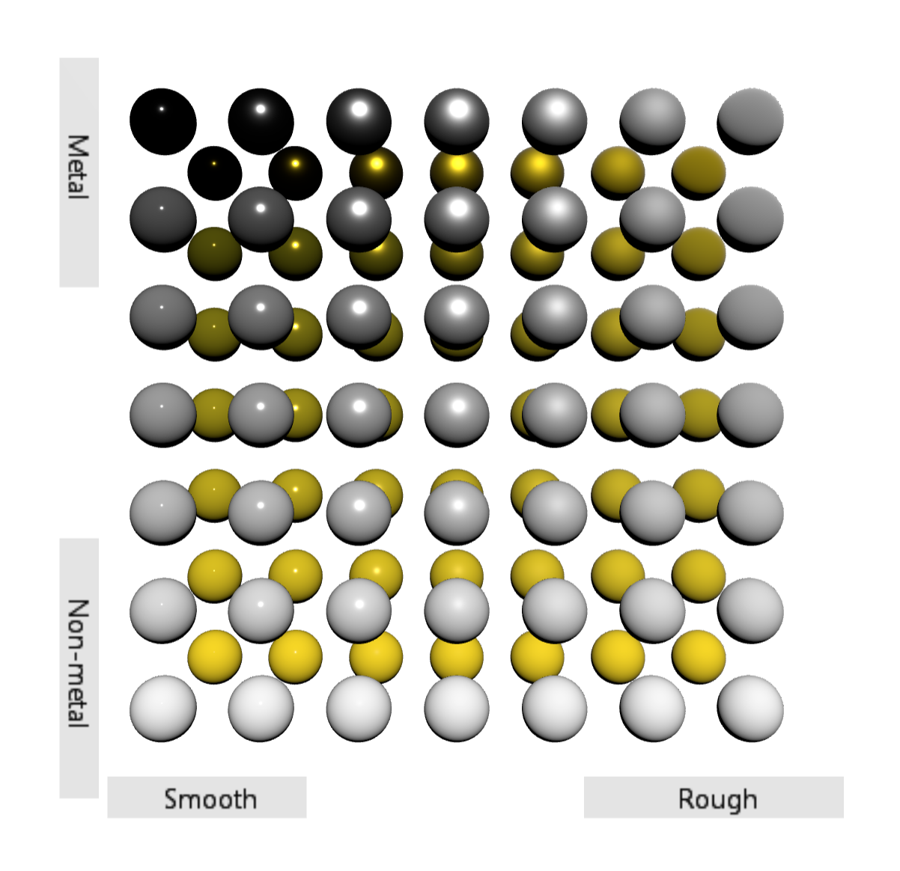

# WebGL-PBR-Demo

shader 代码主要来源 games104 Pilot `mesh.frag`

## TODO

- ✅ debug最左侧无高光 (D_GGX roughness -> rroughness)
- IBL
  - HDR球形全景图(Equirectangular Map)转CubeMap
  - 漫反射部分的辐照度(Diffuse irradiance)
  - 镜面反射IBL(Specular IBL)